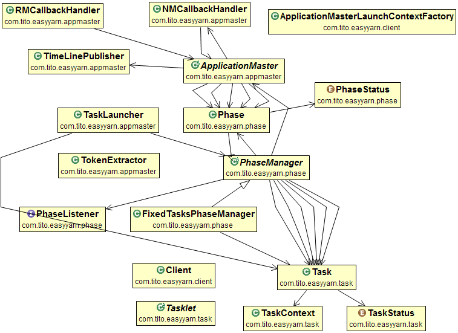
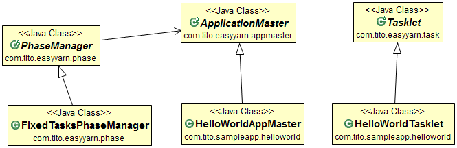
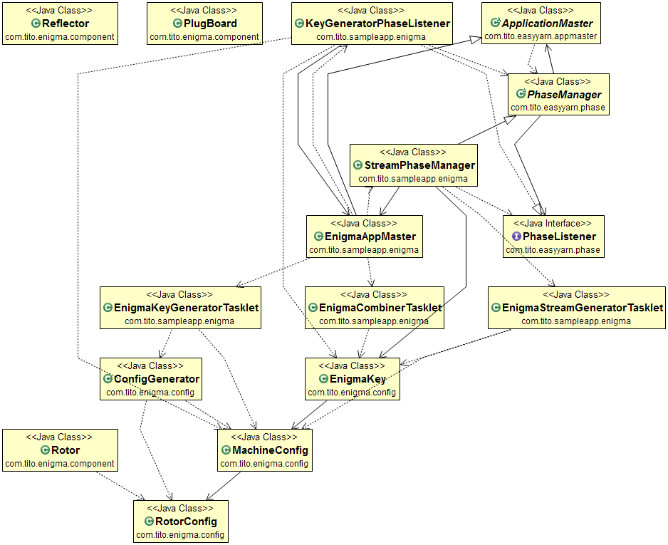

# Easy Yarn  [](https://travis-ci.org/mrfawy/enigma-yarn)
------------------


## What's Easy Yarn?
Easy yarn is a framework that abstracts the yarn framework complexity and provide a simpler API allowing developers to focus more on their application logic.

## Why not direct YARN  ?
Apache Yarn is very powerful and flexible, but this comes at a cost. YARN can be quite difficult to use and requires a steep learning curve to get started. YARN provides very low level API and developer has to learn 3 different protocols and write lots of code just to get an app up and running . The hello world app in yarn is distributed shell , it's ~2000 lines of code, a big burden for developers to learn and use yarn .

Many distributed applications have common needs such as application life cycle management, distributed process coordination and resiliency to failure. Unfortunately Yarn doesn't provide any support to tackle these issues and it's the developer responsibility to do so .

## Why Easy Yarn?

Easy yarn comes to play to complement the points where Yarn fails short . It provide a simpler API and distributed building blocks for developer, manages application life cycle and restart and reallocates tasks in case of failure transparently.  We believe Yarn is a great platform to develop distributed apps and easy yarn makes this much less painful and more enjoyable for all yarn developers.

## Features 
* Leveraging Yarn resource allocation capabilities, hiding its complexity 
* Application life cycle management, argument passing, and monitoring/reporting to history server
* Fault tolerance: Whenever a machine in the cluster fails, easy yarn works with YARN to transparently migrate your tasks to another machine.
* Processor isolation: Easy yarn works with Apache YARN, which supports Hadoop’s security model, and resource isolation through Linux CGroups.
* Simpler API programming constructs, abstracting yarn complexity:
  * TaskLets to implement individual work units
  * Phase for parallel Task execution
  * Phase Listeners for handling phase events 
  * Phase managers for common scenarios
  * Custom phase managers for complete control
  * Custom Application master to register phases
* Distributed programming constructs (in progress)
  * IPC via messaging between Tasklets : point to point, broadcast, or publisher subscribe  
  * Unified shared memory ( Distributed memory)
  * Process synchronization mechanism (Zookeeper based):
      * locks ( read/write)
      * condition variables
      * semaphores

and more ..

## Comparison with other projects
-------------------------------------------

### Spring-Yarn
Spring yarn handles the lifecycle and allows user to use spring functionalit. Unlike easy yarn it doesn't handle failures nor provides any distributed building blocks like messages passing or synchronization mechanisms. Moreover Spring yarn takes an opinionated decisions which might work at the beginning but won't be flexible enough to customize later. 

###Apache Twill ( Incubator)
Twill provides a programming model similar to threads over yarn. It overlaps with easy yarn in managing the life cycle and a thread like behavior . Easy yarn takes a different approach of providing a thread like behavior that's simpler and doesn't depend on runnable interface.Also, easy yarn provides a separate synchronization mechanisms . if not aware enough, a Twill user might use java constructs which won't work in a distributed environment although same API (Threads) works fine for non distributed ones, might be a confusing way of doing things we think.

### MPI on yarn ( mpich-yarn by Alibaba):

MPICH-yarn is an application running on Hadoop YARN that enables MPI programs running on Hadoop YARN clusters. 

The prospect of running Open MPI under YARN has been investigated by Ralph H. Castain of the Open MPI team. YARN was compared with the SLURM HPC scheduler as a platform for running Open MPI applications. The results heavily favored SLURM because of some of the fundamental design differences between the two approaches to cluster resource utilization.

Easy yarn doesn't aim to replace or implement MPI standard (~800+ page) on yarn. Instead by providing a simpler API and synchronization building blocks applications written for Yarn could be made simpler, High performance computing (HPC) might needs further adjustments to be yarn ready.

* references: 
  * https://github.com/alibaba/mpich2-yarn
  * http://www.admin-magazine.com/HPC/Articles/The-New-Hadoop
  * http://www.mpi-forum.org/docs/mpi-3.1/mpi31-report.pdf

## Getting Started 
---------------------------

### YARN in a nutshell 
YARN (Yet Another Resource Negotiator) is Hadoop’s next-generation cluster scheduler. It allows you to allocate a number of containers (processes) in a cluster of machines, and execute arbitrary commands on them.

##### YARN Architecture


YARN has three important pieces: a ResourceManager, a NodeManager, and an ApplicationMaster. In a YARN grid, every machine runs a NodeManager, which is responsible for launching processes on that machine. A ResourceManager talks to all of the NodeManagers to tell them what to run. Applications, in turn, talk to the ResourceManager when they wish to run something on the cluster. The third piece, the ApplicationMaster, is actually application-specific code that runs in the YARN cluster. It’s responsible for managing the application’s workload, asking for containers (usually UNIX processes), and handling notifications when one of its containers fails.

* References:
  * http://hortonworks.com/blog/apache-hadoop-yarn-background-and-an-overview/


### Easy Yarn in a nutshell

#### Core Easy Yarn



- Client : Submit application to YARN and allocate and run application master
- ApplicationMaster: Manage life cycle and works closely with YARN to allocate more containers according to phase's tasks
- Task : a metadata for a work unit , it has Id and launch context 
-Tasklet : work unit , code to execute when container is allocated
- Phase : a collection of Tasks to run in parallel
- Phase manager: Manages a life cycle for a group of tasks

#### Services (In progress)

Easy Yarn provides some services needed for a typical distributed application. These services spans the whole application life cycle . Typically application master will enable the needed service package during application startup . 

At the movement the expected services will cover 2 domains :
- InterProcessCommunication (IPC)  via messaging 
- Synchronization via locks , semaphores 

ZooKeeper will be used to 


Services has a separate framework to write your own and register them at application scope , easy yarn will make sure service is distributed across needed resources . 

### Writing your own apps

- Extend Tasklet, define any arguments and their handling , implement start method 
- Extend Application master and define your phases, arguments to be passed and handle them
- if needed , extend PhaseManager or implement a phase listener 
- Configure an uber jar with its main-class to be Easy yarn Client
  - in Maven it looks like :

```
<plugin>
<artifactId>maven-assembly-plugin</artifactId>
				<executions>
					<execution>
						<phase>package</phase>
						<goals>
							<goal>single</goal>
						</goals>
					</execution>
				</executions>
				<configuration>
					<descriptorRefs>
						<descriptorRef>jar-with-dependencies</descriptorRef>
					</descriptorRefs>
					<archive>
						<manifest>
							<mainClass>com.tito.easyyarn.client.Client</mainClass>
						</manifest>
					</archive>
				</configuration>
</plugin>			
```


#### Running your application
* Use HDFS to copy the application Jar to cluster
* Submit app to Yarn 

```
yarn jar [app jar path] -jar[app jar path] -appMasterClass [your custom AppMaster class] 
```

Please note that [app jar path] is provided twice , first for Yarn to start your client , second for Application master to copy it as a local resource for allocated containers (including its own)

Note: if your jar has no manifest file with main class as client , provide the Client main class as well

#### Debugging your application 
There's no direct way to do this in YARN but you can run as a single node yarn ,or check yarn logs .

For more info please check : 
https://github.com/jpatanooga/Metronome/wiki/Debugging-YARN-Applications


## Sample programs 
---------------------------

### Helloworld 

This programs spawns a single phase with a single Task that write to the allocated container stdout.

* First we define our work unit : 
Under the hood it's a java process that will run on an allocated container in the cluster

``` 
public class HelloWorldTasklet extends Tasklet{	
	@Override
	public boolean start() {
		System.out.println("Hello world with Easy Yarn!");
		return true;
	}
       @Override
	public boolean init(CommandLine commandLine) {		
		return true;
	}
	@Override
	public void setupOptions(Options opts) {	
		
	}
}

```

* Write HelloWorld App Master to design a single phase with this task , as we know the total number of tasks beforehand  we can use ```FixedTasksPhaseManager``` 

```

	@Override
	protected void registerPhases() {

		Task t = new Task("task", new TaskContext(HelloWorldTasklet.class));
		List<Task> fixedTasks = new ArrayList<>();
		fixedTasks.add(t);
		Phase phase1 = new Phase("phase 1", new FixedTasksPhaseManager(this, fixedTasks, null));
		registerPhase(phase1);

	}

```

* Package your jar and run as explained in writing tour own apps section 



That's it , in less than 5 lines of code without dealing with any of the 3 Yarn protocols!
 
### Distributed shell

This is the typical  hello world of Yarn , run a shell command across n containers in the cluster.

* Let's start with our tasklet , first it needs a command to run , to define arguments we implement ``` setpOption``` with the expceted arguments to be passed ( later we will define how to actually pass them via TaskContext )

```

public void setupOptions(Options options) {
		options.addOption("command", true, "Shell command to run");

	}
	
```

* we validate the argument when passed , returning false for error to signal task as failed 


```
public boolean init(CommandLine cliParser) {
		if (!cliParser.hasOption("command")) {
			LOG.error("Missing command");
			return false;
		}
		command = cliParser.getOptionValue("command");
		return true;
	}
	
```

* Now for application master , we extend ``` ApplicationMaster``` and define the needed arguments , in our case it number of containers and the command to run , then validate them as before 

```
		@Override
		public void setupOptions(Options opts) {
			opts.addOption("n", true, "Number of containers to run the command ");
			opts.addOption("command", true, "Shell command to run");
		}
		@Override
		public boolean init(CommandLine cliParser) {
			if (!cliParser.hasOption("command")) {
				LOG.error("Missing command");
				return false;
			}
			command = cliParser.getOptionValue("command");
			if (cliParser.hasOption("n")) {
				LOG.error("Missing n");
				return false;
			}
			try {
				n = Integer.parseInt(cliParser.getOptionValue("n"));
			} catch (NumberFormatException e) {
				LOG.error("Invalid Number:", e);
				return false;
			}
			return true;
		}

```

* Now we can spawn a single  phase with fixed number of tasks (n) and pass the command to them via their taskContext  as follows :

```

		List<Task> fixedTasks = new ArrayList<>();
		for (int i = 0; i < n; i++) {
			TaskContext taskContext = new TaskContext(ShellTasklet.class);
			taskContext.addArg("command", command);
			Task t = new Task("task" + i, taskContext);
			fixedTasks.add(t);
		}
		Phase phase1 = new Phase("phase 1", new FixedTasksPhaseManager(this, fixedTasks, null));
		registerPhase(phase1);
		
```

That's it , to run you simply append n,command to the run command explained before and every thing will work as expected . EasyYarn will spawn n containers and run this command on them .

Compare this with the distributed shell sample program provided by yarn , it's the hello world of yarn development (~2000 lines of code)

Note that everything we wrote is directly application specific logic. no boilerplate code . 

* references:
  * https://github.com/apache/hadoop-common/tree/trunk/hadoop-yarn-project/hadoop-yarn/hadoop-yarn-applications/hadoop-yarn-applications-distributedshell


###Modern Enigma
>"If a trick is over used, it's less likely that anyone will expect us to use it again” 

Previous Samples showed the basic steps to develop yarn app , we'll build on these concepts and develop a moderately complex app with more than one phase.Modern Enigma is a sample program that shows you what a typical application you write will look like. 

Please check the project source code to see how to use custom phase managers,listeners , multiple phases , several inputs contexts and so on .

Here we'll briefly explain what's modern enigma and how this distributed app is developed by easy yarn .

Note: This work is based on my other project ModernEngima ,you can find it here :
https://github.com/mrfawy/ModernEnigma

#### Introduction

>"If a trick is over used, it's less likely that anyone will expect us to use it again” 

The above motto is a quote from a comic movie, and hence this fun project came into existence, it aims to revive the famous (ehm, for being cracked) Enigma machine .But why bother? 

Protecting your privacy today? Well, good luck. you are using tools that you don't know how it's working (you shouldn’t trust), and when they are cracked you'll barely know after it's too late .So if you can add an extra level or encryption of your data even if it's a homegrown technique, it'll make the problem for your attacker just a little bit harder .Modern Enigma tries to provide a step in this direction.

Alan Turing is considered to be the father of modern computing, at his time electro-mechanical machines were used to perform computations. This is a software implementation with enhanced features to prevent some weakness points in original Enigma.

>Modern Enigma is not patented and will never be.. myself

#### What's Enigma?

Before we start , Please check this video to see an enigma explained with the mathematics behind it 

https://www.youtube.com/watch?v=G2_Q9FoD-oQ


Generally speaking it's an encryption machine used by Germans during WWII to encrypt the communication between forces , the allied were able to crack it ( Alan Turing is the most famous team member), and that led to their defeat. Deciphering Enigma  messages is still in progress ,look for the M4 project if your interested !

Speaking in modern terms: Modern enigma is a symmetric encryption , stream cipher (byte based), substitution box.

#### Inner workings 



Encryption typically  has 3 phases:

* Generate new key ( could be skipped to use a previous key , not recommended though)
  * it'll spawn N containers and generate N machine specifications 
  * After phase is finished , Phase listener will group machine specs into one key and add machine combining sequence 
* Stream generation , at bird's eye view each enigma machine is a actually a substitution box , so to encrypt input of N bytes we need 256 byte map for each input byte. Stream generation phase will spawn N machines and generate these mapping for all input signals 
* Combine phase. Given several machine mapping streams and their order , combine the input stream with these mapping to determine the output.( Single Task)

Decryption has 2 phases:

* Stream generation , given the key perform as explained before .
* Combine phase. Same as explained before , the gotcha here is to combine in reversed direction of mapping , given map x->y now combine using rule y->x .( Single Task)

* A given workDir is used on HDFS to generate temp machine specs and streams.
Note: when Distributed memory service is ready ,HDFS will be replaced by it for faster processing.

#### Sample usage

- Encrypt command

 ``` 
yarn jar enigma-yarn-app-1.1.0.jar -jar enigma-yarn-app-1.1.0.jar -appMasterClass  com.tito.sampleapp.enigma.EnigmaAppMaster -enigmaCount 3 -enigmaTempDir /enigmaTempDir -plainTextPath  /test/enigma/plain/plain.txt -cipherTextPath /test/enigma/cipher/cipher.text -keyPath /test/enigma/EnigmaKey.key  -operation e  

  ```

- Decrypt command

  ```
  
yarn jar enigma-yarn-app-1.1.0.jar -jar enigma-yarn-app-1.1.0.jar -appMasterClass  com.tito.sampleapp.enigma.EnigmaAppMaster -enigmaTempDir /test/enigma/enigmaTempDir -plainTextPath  /test/enigma/plain/plain_decrypted.txt -cipherTextPath /test/enigma/cipher/cipher.text  -keyPath /test/enigma/EnigmaKey.key -operation d

  ```


#### What went wrong with Enigma that led to its fall?

Many Design and operating problems allowed the allied to crack it, just to name a few

* Design
    * No letter is mapped to itself
    * Constraints on Rotor usage in certain days of month
    * Fixed number plug board cables
    * Rotor stepping in a predictable clockwise motion, US implemented SIGABA to fix this problem

* Operation
    * Message indicator settings were chosen by operators none randomly (CIL)
    * Predictable clear text (Cribs)
    * Using less secured means to send the same message 

* For more info:
    * Weakness points in enigma, [more info](http://cromwell-intl.com/security/history/enigma.html "for more info")
    * SIGABA working, [more info](http://ucsb.curby.net/broadcast/thesis/thesis.pdf)

#### Modern Enigma Features:
* It's a protocol that can be implemented by many environments; currently we provide yarn java code as the reference implementation 
* Dynamic configuration of the machine, thus no single machine with fixed wiring that can be reverse engineered 
* A new random settings and  a new set of machines per message 
* More Rotors and larger rotor size to increase the key space   
* Non clockwise rotor stepping
* Non linear Rotor swapping during encryption process
* Multilevel Encryption each consists of various rounds(in progress)
* After all, it's just software, just some lines of code , no hardware to carry ;)

#### Basic Concepts
----------------------- 
 
You need to understand some components to understand how a machine works
Here is an overview of the main components of a machine


#### Rotor
A rotor is a like a switch, historically, rotor was a cylinder with internal wrings; depending on the wiring each input signal will be mapped to some output pin. In modern terms a set of rotors works as a substitution box. It rotates meaning each new position (offset) can result to a different output for the same pin.
As rotor rotates (stepping), different output can result for same input


#### Reflector
Reflector is like a rotor but it doesn't move and the wiring has a certain rule that it can wire to same pin or reflect the wiring A->X THEN X->A

#### Plug Board
A plug board is like a Reflector, but you can arbitrarily configure the wiring per as you need per setting 

#### Keyboard and screen
It’s here just for historical reasons, but files, byte streams will be used instead

#### Inside a machine 
Please follow numbers in the image below to get an idea about how signal is propagated into different machine modules during operation


#### How secure Is Modern Enigma?
>Any person can invent a security system so clever that he or she can't imagine a way of breaking it...Schneider’s Law

It means that people create a cipher that they themselves can't break, and then use that as evidence they've created an unbreakable cipher.

>A cryptosystem should be secure even if everything about the system, except the key, is public knowledge .. Kerckhoffs's principle 

Based on these 2 principles we provided an open source machine and tried to make it's security based on the key that will have many parameters to alter the machine working.
We tried to fix the original Machine problems , provided a new protocol with different machines needed for each operation, minimized any component dependency in the machine ,we simplified a machine creation operation so you can use a new set of machines for each message ,you can use it even as a one time pad if it's works for you.

So the right question should be is it secure enough for your needs ? You decide,we are still investigating the weaknesses points of this tool.For sure this not to be used in any mission critical app.

###### Any help from an expert on the security assessment or cryptoanalysis of this Modern Enigma is highly appreciated; it’s still in early development phase.

#### Mathematics of Modern Enigma:

Security can be largely affected by a key size  and available states the machine can take (key space ) , here we show how you can calculate key space for sample machine:

* Counting Equations:
    * Number of available rotor wiring for a rotor of size N=N!, e.g. a rotor of size 64 =>64! ~ 1.3 x 10^9
      * The number of atoms in the visible universe (~ 10^80)
    * Number of ways to pick n rotors each of size of N in order =P(N,n) , e.g Wolfram couldn't calculate P(64!,3)"Result cannot be determined using current methods" 
    * Number of ways to set rotors offsets for n rotors each of size N  = N ^ n
    * Number of ways to select M pair for plug board of size N=N! / ( (N-2M)! x M! x 2^M ) 
* Cipher Module:
    * Number of available Cipher rotors per machine = n , we recommend larger n >100

* Swapping Module(in progress)
    * Level 1 : pick l1 rotors each of size 64 (see above)
    * Level 2 :pick l2 rotors each of size K (see above)
    * l1 l2 mapper As a rotor like above
    * l2 Cipher mapper as a rotor like above
    * Number of ways to select active signals of size s= C(64,s)

* You can calculate the total key space and the different possible machine configurations , but don't let the number deceive you , it only works if you are trying a brute force attack .

* Deriving A key size :
    * To encrypt/decrypt a single level 2 machines are needed
    * for each machine we need :
        * n bits to represent n cipher rotors orders, and offsets
        * l1 bits to represent l2 cipher rotors orders, and offsets
        * l2 bits to represent l2 cipher rotors orders, and offsets
        * m bits to represent wiring mapping of l2 Cipher mapper
    * around 10-12 * integer(32 bit),of various flags that alter the working of the algorithm


* An example for a Cipher module of 100 rotors each of size of 64 :
    * Number of bits to store the rotor offset [0-64] = 6 bits
    * Number of bits ( Key) to store machine setting of N rotors =m(no of bit to represent N)xN +6xN
    * Result # of bits =7x100+6x100=1200 bits ( Only for this module, while a typical machine will have 2 more modules)

* it's worth mentioning here that the key is part of the operating instructions, it's like the manual for the algorithm , Thus it'll be a large number of bits.

##### Please don't let the large key size fool you. it works for brute force attacks , any help from an expert is appreciated


#### Modern Enigma Protocol :
* General Guideline:
    * In this protocol we define a certain steps that has to be performed, for each step a certain algorithm will be chosen. As each step has it's own attack vectors and it's algorithm has it's vulnerabilities, each major version of this protocol will try to cope with that .Backward compatibility is not currently one of our main design goals.
* Main design Goals :
    * Confidentiality 
    * Message integrity 
    * Close to the original enigma rotor based design (as its main substitution box technique)
    * Operating instructions should be part of the key; no fixed decision should be made by the machine 
    * Generation of a new machine should be an easy and a low cost operation
    * Extreme flexibility in designing your own machine down to  the wiring level 
    * Platform independence, ability to de/encrypt using any platform/environment, extremely low resources (e.g. card) are not considered
    * Generation of human readable machine description, allowing the reconstruction of a machine 
    * No use of patented or platform specific algorithms 
    * It's a fun project, not the next Symmetric key poly alphabetic encryption technology, please keep this in mind 
* Out of scope:
    * Not to be used for mission critical apps 
    * Key management/sharing process is not handled , use any key management technique you desire.
            
Because the keys and machine descriptions are human readable, old tricks can still work(remember our Motto) .Be creative and use overused techniques like calling your friend by phone and telling him part of the key ,SMS another part , Facebook another part, and if you are not in a hurry you can send a postal mail ;).of course all of theses platform might be tracked (well ,you know it's ).If the attacker was able to track all of these communications ,well, I think this guy  deserves to read your messages any way, nothing can help you my friend ;)


License Terms and disclaimer:
-------------------------
Modern Enigma is licensed under MIT terms .Modern Engima is not patented and will never be . Like any tool it can be used for good or any thing else .The main goal was to enhance user privacy means. Project Team holds no responsibility for any illegal use or damage .

References:
----------------
what it is ?
https://www.youtube.com/watch?v=G2_Q9FoD-oQ
http://enigma.louisedade.co.uk/howitworks.html
https://www.youtube.com/watch?v=mcX7iO_XCFA
http://www.cryptomuseum.com/crypto/enigma/working.htm
https://www.youtube.com/watch?v=ncL2Fl6prH8
http://en.wikipedia.org/wiki/Enigma_machine


* Suggessted protocol
http://hireme.geek.nz/modern-enigma-system.html
http://digital.library.louisville.edu/utils/getfile/collection/etd/id/449/filename/450.pdf
http://www.cs.sjsu.edu/faculty/stamp/students/Sigaba298report.pdf

what's wrong with it ?
https://www.youtube.com/watch?v=V4V2bpZlqx8
http://www.mlb.co.jp/linux/science/genigma/enigma-referat/node6.html
http://cromwell-intl.com/security/history/enigma.html
http://en.wikipedia.org/wiki/Cryptanalysis_of_the_Enigma


Modern Encryption techniques:
https://www.gnupg.org/gph/en/manual.html

history : http://www.eng.utah.edu/~nmcdonal/Tutorials/EncryptionResearchReview.pdf


## Acknowledgements
Thanks for Apache Yarn , Java , and open source community for making this project feasible .
> If I have seen further it is by standing on the shoulders of giants.. Isaac Newton
